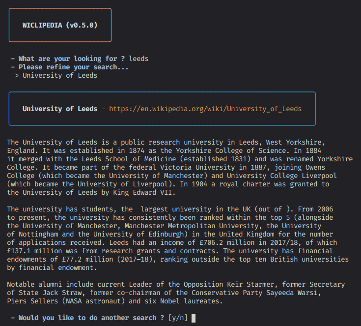

<h1 align="center">
  Wiclipedia
</h1>

<h4 align="center">
  Wikipedia articles summaries in your terminal
</h4>

<div align="center">
  
</div>

## Description

Wiclipedia is a CLI app made with nodeJs that let you search through wikipedia and display articles summaries in a practical way.

## Install

### Yarn

```bash
yarn global add wiclipedia
```

### NPM

```bash
npm install --global wiclipedia
```

## Usage

```
$ wicli --help

  Usage
    $ wicli [<options> ...]

    Options
        none              launch wiclipedia
      --version, -v       print app version
      --lang, -l          set language for wikipedia articles (english by default)
      --previous, -p      display and use previous searches
      --clear, -c         clear search history
      --random, -r        suggest random articles

    Examples
      $ wicli
      $ wicli --lang
      $ wicli --previous
      $ wicli --random
```

## Development

- Fork the repository and clone it to your machine
- Navigate to your local fork: `cd wiclipedia`
- Install the project dependencies: `npm install` or `yarn install`
- Lint the code for errors: `npm lint` or `npm lint-fix`

## License

[MIT](https://github.com/kikiklang/wiclipedia/blob/master/license.md)
